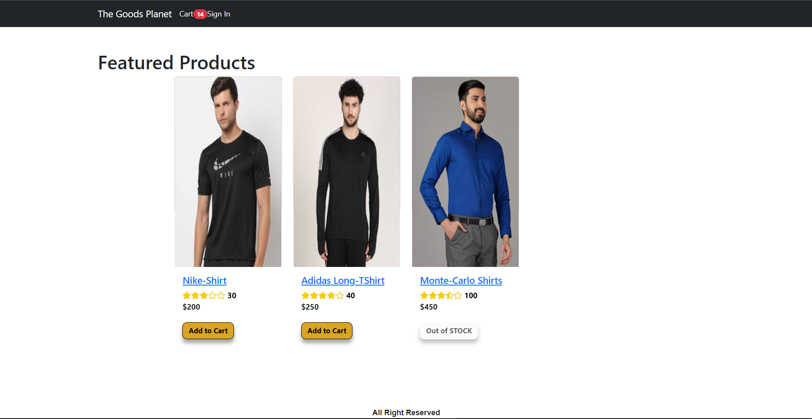
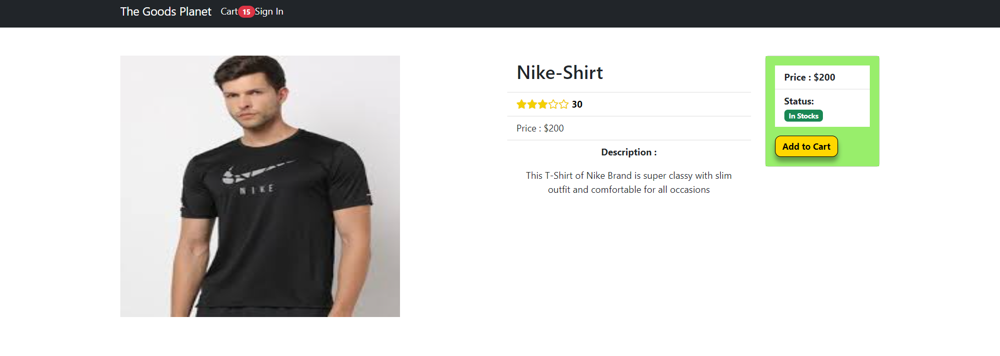
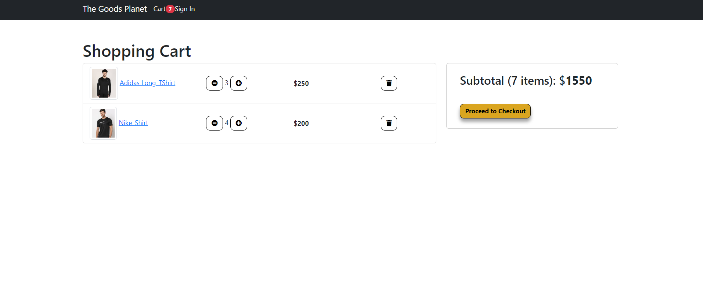
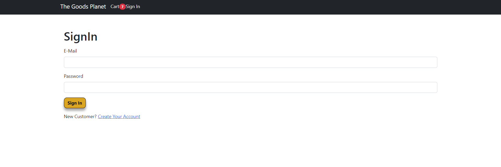

# E-COMMERCE STORE
 `A Perfect E-Commerce store that  offers a variety of products, detailed descriptions, a user-friendly cart, and personalized user profiles for a smooth shopping experience.`

## Tech Stacks:
  >Frontend:
  * `ReactJS`
  * `Redux`
  * `CSS Properties`
>Backend:
 * `NodeJS`
 * `ExpressJS`
> Database:
 * `MongoDB`
  

### Page has Links to : Home Page,Cart Option,User Profile.

# **Insights of Project**

* Visiting the **Home Page**  , having Simple User Interface & Products Display.

2. Entering the  **Product & Description** Page with Add to Cart Features

3. The **Cart Page** Shows Added Items 

 4. On Proceeding ,it redirects ti **SignIn** Page

5. On Successful Sign ,it redirects to  **SHipping Page** Page along with **User Profile**

### Features Like Payment Gateway ,Discount etc. will be added..

**Looking forward for your Feedback. Trying to Improve it**